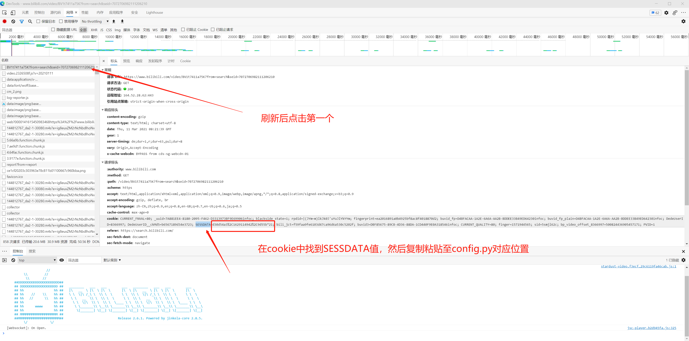

# Bilibili视频下载

<div align="center">
    
</div>

<div align=center>
    
    
    
    
    
</div>

## :pushpin: 功能说明

- [x] B站视频下载
- [x] 支持使用账号cookie下载大会员视频
- [ ] 批量下载【待更新】
- [ ] 支持番剧下载【待更新】
- [ ] 其他【待更新】

## :white_check_mark: 安装依赖库

```bash
pip3 install -r requirements.txt
```

## :pencil2: COOKIE设置说明

打开`config.py`，**需要定期(30天)替换**cookie中的`SESSDATA`值

替换方法：

1. 浏览器登录B站，打开要下载的视频页
2. `Ctrl + Shift + I`或者鼠标右键选择检查，然后选择`网络`
3. `Ctrl + R`刷新网页，选择第一个，请求表头中找到`cookie`
4. cookie中找到`SESSDATA`值替换



## :rocket: 运行方法

`python main.py`后面加上想要下载的视频URL即可

```bash
# python main.py URL
python main.py https://www.bilibili.com/video/BV15b4y1R7fK\?p\=1

下载的视频清晰度：超清 4K
开始下载视频： 【4K收藏级画质】吹响吧！上低音号 1~2季NCOP、NCED 无字无水印素材.mp4
开始下载音频： 【4K收藏级画质】吹响吧！上低音号 1~2季NCOP、NCED 无字无水印素材.mp3
Moviepy - Building video /home/user/Programming/Python/bilibili-downloader/bilibili_video/【4K收藏级画质】吹响吧！上低音号 1~2季NCOP、NCED 无字无水印素材.mp4.
Moviepy - Writing video /home/user/Programming/Python/bilibili-downloader/bilibili_video/【4K收藏级画质】吹响吧！上低音号 1~2季NCOP、NCED 无字无水印素材.mp4

Moviepy - Done !                                                                                                                                                                                                                                                                     
Moviepy - video ready /home/user/Programming/Python/bilibili-downloader/bilibili_video/【4K收藏级画质】吹响吧！上低音号 1~2季NCOP、NCED 无字无水印素材.mp4
视频合成结束
总计用时：5分钟32秒
```

## :tv: 运行效果


